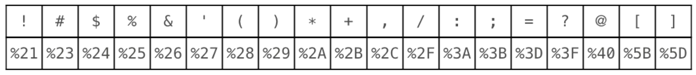

# PHP-MySQL-Tutorial
PHP with MySQL Essential Training from LinkedIn Learning

## Course resources
1. [PHP with MySQL Essential Training: 1 The Basics](https://www.linkedin.com/learning/php-with-mysql-essential-training-1-the-basics/default-values-for-url-parameters?u=76215914)
2. [PHP with MySQL Essential Training: 2 Build a CMS](https://www.linkedin.com/learning/php-with-mysql-essential-training-2-build-a-cms/introduction?u=76215914)

## Notes
#### Build Web Pages with PHP
* Ternary conjunctions:
```
$page = isset($_GET['page']) ? $_GET['page'] : '1';
// This checks if there's an existing value for page in $_GET, if there is then use it but if there's not then use 1 instead
$page = $_GET['page'] ?? '1'; // PHP > 7.0
```
* Reserved characters in URL

   * Four principle ones:
   
* `urlencode` VS `rawurlencode` (For reserved characters)
   * Letters, numbers, underscore, and dash are unchanged.
   * Reserved characters are encoded.
   * `urlencode`: spaces become "+".
   * `rawurlencode`: spaces become "%20".
   * When to use them?
      * `rawurlencode` the path. Path is the part before "?". Spaces must be encoded as "%20"
      * `urlencode` the query string. Query string is the part after "?". Spaces are better encoded as "+". (This is the one is needed far more often)
* `urldecode` and `rawurldecode`
   * You'll rarely need them because PHP automatically decode the URL when it receives it.
* `htmlspecialchars($string)` (For the four principle reserved chars. This will be used a LOT)
   * MAKE SURE to use it whenever you use dynamic data and output that data, otherwise you might have XSS (cross-site scripting attack) which is a major security vulnerability.
   
#### Headers and Redirects
* Headers are a little information that gets sent before HTML.
   * `header($string)` can be used to change the default information in the header and/or add additional information. For example, `header("Content-Type: application/pdf");` tells the browser that instead of html we are about to send pdf file. `header("HTTP/1.1 404 Not Found");` returns an error message.
   * Modify headers:
      * Headers are sent before page data
      * So changes must be made before any HTML output (like before a single space or line return, whitespace in included files.
* Page Redirection
   * Page redirects are sent in headers
   * Headers are sent before page data
   * Header changes must be made before any HTML output
   * Page redirects must be sent before any HTML output
* Output Buffer
   * Data in output buffer is still editable
   * Headers can be changed
   * Whitespace can be sent before header edits and redirects
   * Two ways to turn on output buffer:
      * In `php.ini` file. How to tell if it's turned on? Use `<?php phpinfo(); ?>`. The number shows for the output_buffer will be the size of character that is going to be buffered.
      * In your php code, use `ob_start()`, which start the buffering (it has to come before anything), and `ob_end_flush()`, which ends buffering and flushes whatever results have accumulated in the buffer (it doesn't have to be called explicitly because the end of php code will automatically do that for you).
      * Which one to use? -> it's a good idea to have both.

#### Build Forms with PHP (NEEDS TO BE ADDED AGAIN!!!)
* About checkbox:
   * Good to have a hidden box to send attribute data if users don't check the box.
   
#### MySQL Basics
* Database advantages
   * Read and write data
   * Store more data
   * Keep data organized
   * Access data faster
   * Relate data to data
* Basic MySQL commands (capitalization is not required, but good practice):
   * `SHOW DATABASES;`
   * `CREATE DATABASE db_name;`
   * `USE db_name;`
   * `DROP DATABASE db_name;`
   * Create tables:
   ```
   CREATE TABLE table_name (
    id INT(11) NOT NULL AUTO_INCREMENT,
    menu_name VARCHAR(255),
    position INT(3),
    visible TINYINT(1),
    PRIMARY KEY (id)
   );
   ```
* CRUD (Create, Read, Update, and Delete)
   * SQL SELECT (Read)
   ```
   SELECT *
   FROM table
   WHERE column1 = "some_text"
   ORDER BY column1 ASC;
   ```
   * SQL INSERT (Create)
   ```
   INSERT INTO table (col1, col2, col3)
   VALUES (val1, val2, val3);
   ``` 
   (col and val orders need to match)
   * SQL UPDATE (Update)
   ```
   UPDATE table
   SET col1 = 'this', col2 = 'that'
   WHERE id = 1;
   ```
   * SQL DELETE (Delete)
   ```
   DELETE FROM table
   WHERE id = 1
   LIMIT 1;          /*LIMIT only allows 1 record to be deleted, it's a good thing to do*/
   ```
* Relational database tables
   * SQL ADD INDEX (since the pk will automatically be assigned index but fk won't, index is better to be added for fks)
   ```
   ALTER TABLE table
   ADD INDEX index_name (column);
   ```

#### Use PHP to access MySQL
* **APT** (Application Programming Interface): a set of functions that define the way we use the software.
* Database APIs in PHP (int this tutorial, mysqli is used):
   * **mysql**: original MySQL API
   * **mysqli**: MySQL "improved" API
   * **PDO**: PHP Data Objects ([PDO tutorial](https://phpdelusions.net/pdo#dsn))
   * Differences between three APIs: 
   * [PHP manual page that helps choosing between different APIs](https://www.php.net/manual/en/mysqlinfo.api.choosing.php)
* PHP-Database interaction steps (step 1 and 5 should only happen **once** for one PHP script):
   * Create a database connection
   ```
   mysqli_connect($host, $user, $password, $database)
   ```
   * Perform a database query
     `mysqli_query($connection, $query)`
     `mysqli_free_result($result_set)` (not freeing the result set won't be a big deal when retrieving small amount of data, but it DOES matter when retrieving lots of data)
   * Use returned data (if any)
      * `mysqli_fetch_row`: return the result in a simple array. For example: `['1', 'About Global bank', '1', '1']` which is not ideal since it's easy to forget which value belongs to which column
      * `mysqli_fetch_assoc`: return the result in an associative array that associate the value with the column name. For example, `['id' => '1', 'menu_name' => 'About Global Bank', 'position' => '1', 'visible' => '1']`
      ```
      // A better way to loop through the result array.
   
      // Traditional way:
      $result = find_all_subjects();   // "find_all_subjects()" is a query function that retrieves all the rows in subject table
      $count = mysqli_num_rows($result);
      for ($i = 0; $i < $count; $i++)
      {
          $subject = mysqli_fetch_assoc($result);
          echo $subject['menu_name'];
      }
   
      // A better way is to use a while loop
      $result = find_all_subjects();
      while($subject = mysqli_fetch_assoc($result))
      {
          echo $subject['menu_name'];
      }
      // Analysis: the while loop doesn't need to figure out the row count.
      // The while loop condition is doing testing and assignment at the same time. What the condition is saying is that
      // go and get another row from the result, as long as the assignment returns true, the loop keeps going.
      ```
      * `mysqli_fetch_array`
   * Release returned data
   * Close the database connection (even though database is automatically closed at the end of php script but it's recommended to write it explicitly)
   ```
   mysqli_close($connection)
   ```
* Error handling
  * Database connection error:
    * `mysqli_connect_errno()`: "errno" is the short for "error number". This retrieves the error code from last call connect to the database
    * `mysqli_connect_error()`: returns a string description of that last connect error.
  * Query error

#### CRUD with PHP
* While writing SQL query, it's the best practice to put single quotes around all the variables that you submit to MySQL. For example, 
```
$sql = "SELECT * FROM subjects ";   // The space at the end is super important.
$sql .= "WHERE id='" . $id . "'";  
```
* Use form data to create records
`mysqli_insert_id($connection)`: tells mySQL that you just inserted a new record can you give the id back to me
* Use form data to update records
  * Use UPDATE query
  * Updating a single record requires PK
  * Usually from form data (we'll display the data that is already in the database first and then allow users to change the data by submitting the form)
  * Returns true or false
* Delete a record
  * Use DELETE query
  * Deleting a single record requires record id
  * Form is optional; POST is best practice. (A search engine spider can click on every link you have on the website, but they won't submit any forms)
  * Returns true or false.
